# Motivation

## Old Workflow - R to \LaTeX

1. Do some cool stuff in R:
```{r slide1, eval=FALSE}
mod1 <- lm(mpg~hp, data = mtcars)
with(mtcars, plot(mpg~hp))
abline(mod1)
summary(mod1)
```

2. Copy/save the output/figure.

3. Paste into Latex document:

```{r, eval=FALSE}
\begin{verbatim}
mod1 <- lm(mpg~hp, data = mtcars)
...
\includegraphics{figures/mpg.pdf}
```

## Old Workflow - Problems

- What if we need to make a change?

- Latex is hard and requires a lot of boilerplate.

- Distracting: doesn't facilitate higher-order thinking.

## Reproducibility

- If I win the lottery and drop out of graduate school, could someone else pick up where I left off?

- How long would it take them to do so?

## Interactivity

- We live in the future. Why should our documents be static?

- Interactive documents are useful to everyone: ourselves, our students, executives, etc.

# New Workflow

## New Workflow - Unified Document

1. Do some cool stuff in RMarkdown.

2. Push button.

3. Get PDF.

## New Workflow - Write Code

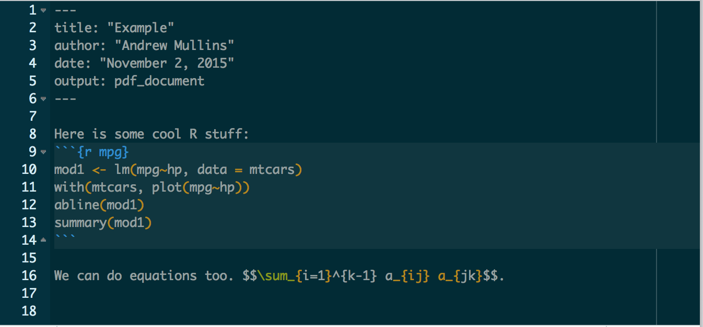

## New Workflow - Push Button

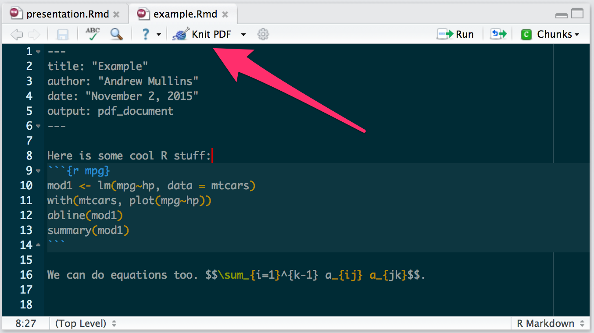

## New Workflow - Get PDF 1

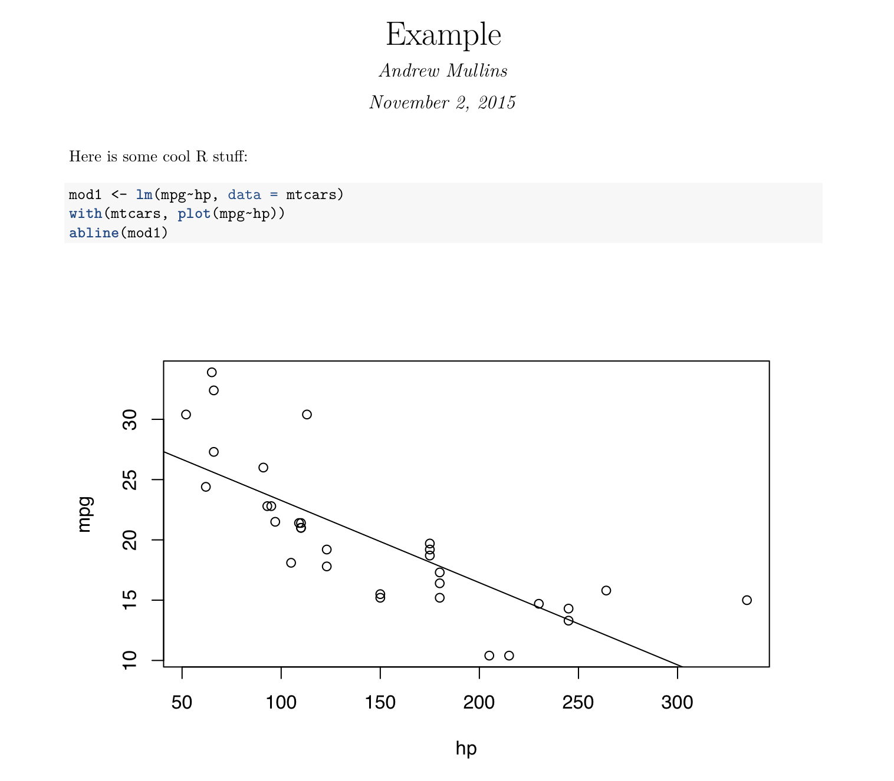

## New Workflow - Get PDF 2

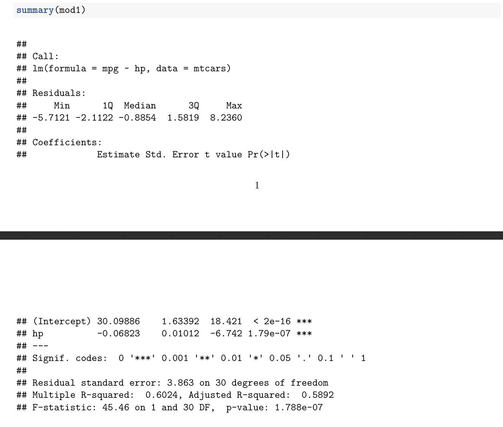

## New Workflow - Get PDF 3

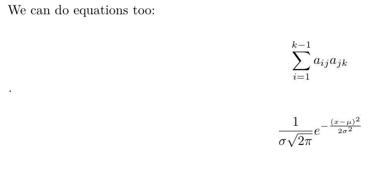

## New Workflow - Make a change

\huge{Just change it in one place and press button.}

# Other Tools

## Sweave

Problem: Sometimes we need the fine-tuned control you can get with Latex.

Solution: Sweave let's use get both the power of Latex while still being able to use in-line R code.

## Sweave Example Code

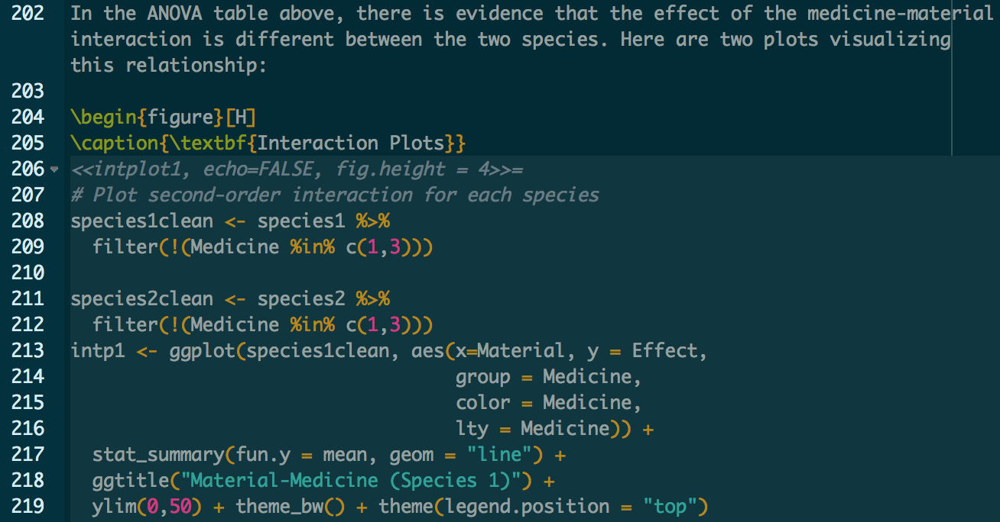

## Sweave Example Output

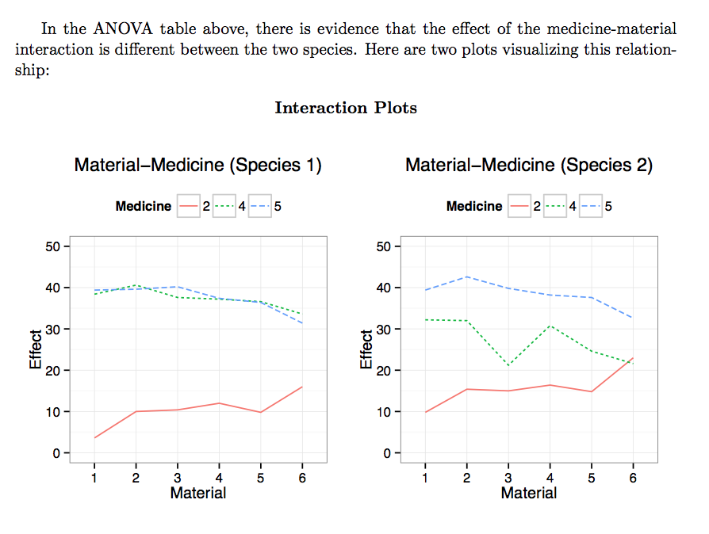

## xtable/stargazer

Problem: R output is ugly.

Solution: `xtable`/`stargazer` creates Markdown/Latex code that is inserted into your document as-is.

## xtable Example Code

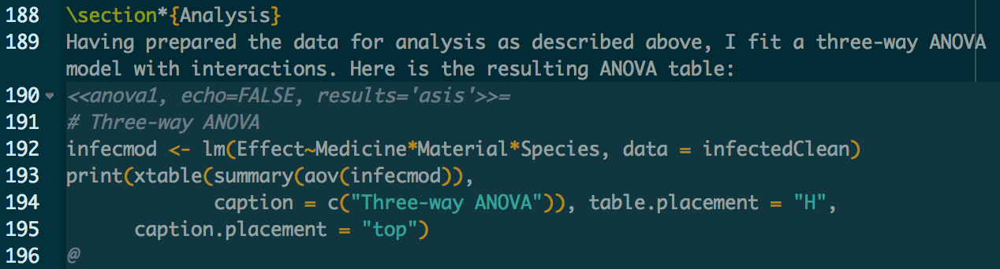

## xtable Example Output

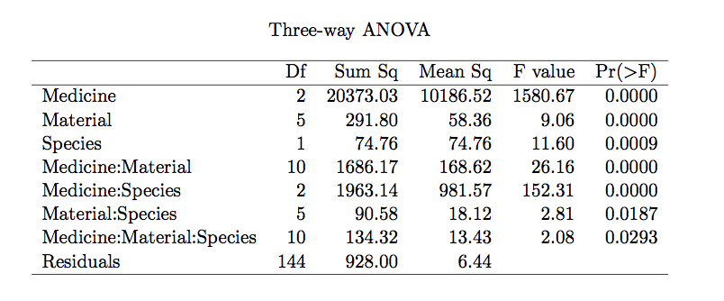

## stargazer Example Code

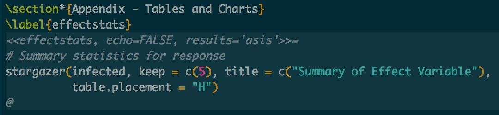

## stargazer Example Output

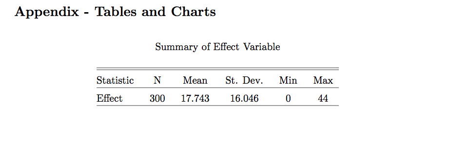

## broom

Problem: A lot of common R objects have bizarre inner structure.

## broom - Example: `lm`


## broom - Example: `lm`

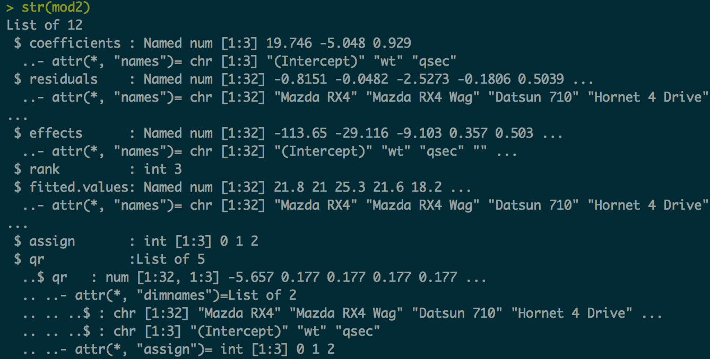

## broom - Example: `lm`

```{r, echo=FALSE}
mod2 <- lm(mpg ~ wt + qsec, data = mtcars)
```
```{r}
library(broom)
tidy(mod2)[,1:4]
```

## broom - Supports

- `lm`, `glm`, `htest`, `anova`, `nls`, `kmeans`, `manova`
- `TukeyHSD`, `arima`, `lme4`, `glmnet`, `boot`, `gam`
- `survival`, `lfe`, `zoo`, `multcomp`, `sp`, `maps`, \ldots

# Learning More

## Examples

- These slides were created in RMarkdown
- Sweave file used for Spring 2015 QEM Submission
- https://github.com/andrewjlm/jrcolloquium
